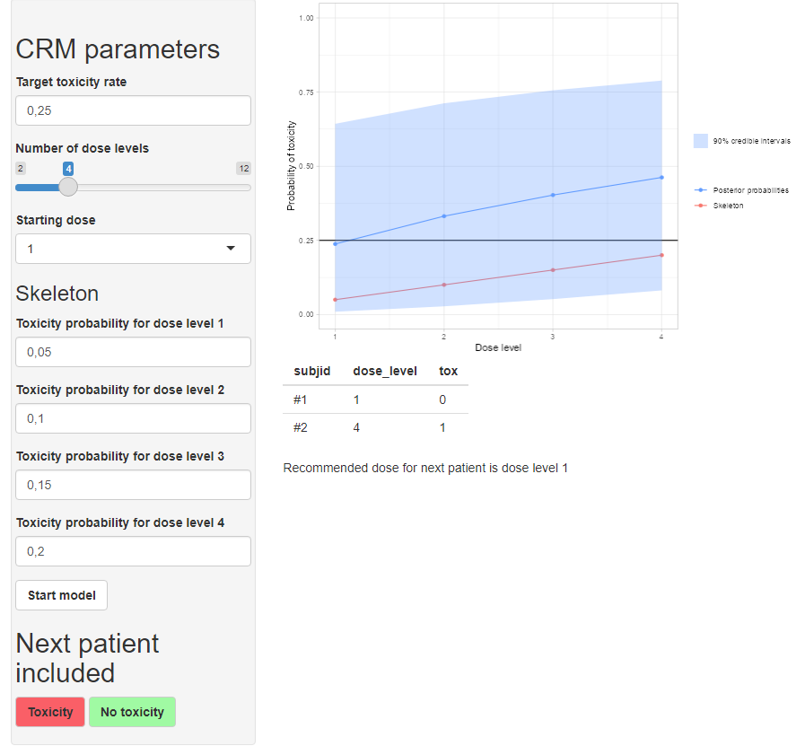

This project is a **RShiny** application developed using the **golem** framework to simulate the evolution of toxicity probability estimates in a dose-finding clinical trial. The app allows users to simulate a clinical trial based on the **Continual Reassessment Method (CRM)**, using the `escalation` R package.


## Installation

```{r installation, eval=TRUE, echo=TRUE, results="hide", warning=FALSE, message=FALSE}
remotes::install_github("BaptisteArchambaud/crmsimulation")
```

## Run application

```{r run_app, eval=TRUE, echo=TRUE, results="hide", warning=FALSE, message=FALSE}
crmsimulation::run_app()
```

<p align="center">

</p>

CRM model is run with get_dfcrm function from `escalation` R package, using empiric model and normal prior on $\beta$ with standard deviation of sqrt(1.34).
